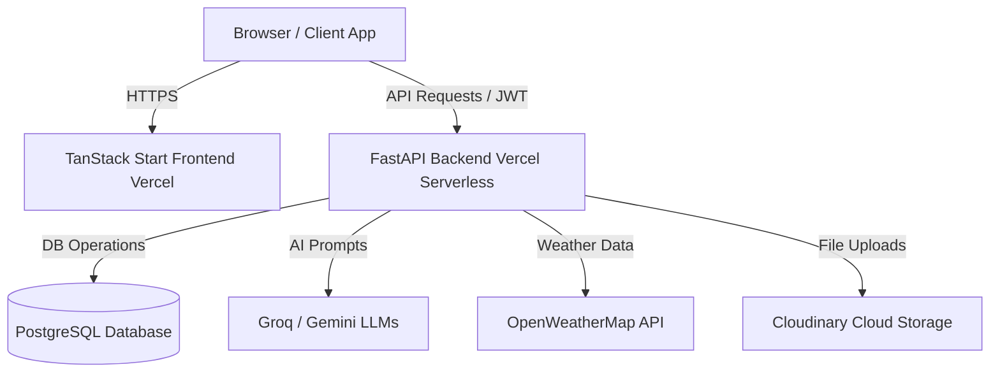

# AI Monsoon Preparedness & Citizen Assistance Platform

An intelligent, real-time crisis management and preparedness platform designed to assist citizens, volunteers, and local authorities before and during severe monsoon seasons. The application uses advanced AI, crowd-sourced hazard mapping, and real-time weather analytics to create a resilient community safety net.

## 🔗 Live Deployments

*   **Frontend Web App (Vercel):** [https://monsoon-preparedness-and-citizen-assistant-fov95vb5m.vercel.app/](https://monsoon-preparedness-and-citizen-assistant-fov95vb5m.vercel.app/)
*   **FastAPI Backend (Vercel Serverless):** [https://monsoon-preparedness-and-citizen-assistance-jsgogdqfn.vercel.app/](https://monsoon-preparedness-and-citizen-assistance-jsgogdqfn.vercel.app/docs)

---

## 🛠️ Technology Stack

The platform is designed with a modern, high-performance decoupled architecture:

### Frontend
*   **Framework:** React 19 (TypeScript)
*   **Meta-Framework:** TanStack Start (features Server-Side Rendering (SSR) and full-type safety for page routing)
*   **Routing & State:** TanStack Router & TanStack Query (cached API state management)
*   **Styling & UI:** Tailwind CSS (utility-first styling), Shadcn UI, and Framer Motion (premium micro-animations)
*   **Mapping:** Leaflet & React-Leaflet (interactive map visualizations)

### Backend
*   **Framework:** Python FastAPI (highly efficient, asynchronous ASGI framework)
*   **Database ORM:** SQLAlchemy with SQLite (local fallback) and PostgreSQL (production cloud database)
*   **Authentication:** JWT (JSON Web Tokens) with OTP (One-Time Password) generation
*   **SMTP Service:** `aiosmtplib` (asynchronous email dispatch for OTP codes)

### AI & Integrations
*   **LLM Orchestration:** LangChain
*   **Inference Engines:** Groq API (high-speed LLaMA models) and Google Gemini API (complex reasoning and emergency task planners)
*   **External APIs:** OpenWeatherMap API (live weather alerts and local flood calculations)
*   **Media storage:** Cloudinary (for storing citizen-submitted hazard photos in serverless environment)

---

## 📐 Project Architecture

---

## ⚙️ Core Application Workflow

1.  **Onboarding & Geolocation:** Citizens register via email OTP. During signup, the browser detects their GPS coordinates to automatically localize all weather alerts, shelter options, and hazards.
2.  **Preparedness Planning:** Users input their household profile (e.g., number of children, elderly, pets). The AI backend dynamically generates a custom preparation checklist.
3.  **Active Monitoring:** The home dashboard displays live local weather updates, calculating a dynamic **Safety Score** and **Flood Risk** percentage based on 24h rainfall statistics.
4.  **Crowd-Sourced Safety Network:** During monsoons, citizens report hazards (e.g., waterlogging, blocked roads, fallen trees) by taking photos and pinpointing locations on a map. Other community members "upvote" reports to verify them in real-time.
5.  **Emergency SOS & Response:** In critical scenarios, clicking the "SOS" button triggers a broadcast. Local shelter capacities are mapped with real-time distance calculations from the user's location.

---

## 💡 Key Functionalities & Why They Are Helpful

### 1. Multi-Lingual AI Monsoon Copilot
*   **What it does:** An AI chatbot powered by Groq/Gemini that answers monsoon safety queries, provides first-aid guides, and drafts emergency evacuation plans in English and local languages.
*   **Why it is helpful:** Provides instant, context-aware safety advice in the user's native language during panic situations, acting as a reliable first responder handbook.

### 2. Live Weather Warning & Safety Score Dashboard
*   **What it does:** Fetches real-time weather statistics and executes algorithmic assessments to compute a local **Safety Score** and **Flood Risk** level.
*   **Why it is helpful:** Offers citizens immediate, easy-to-understand metrics of their current safety levels, helping them make informed decisions on whether to evacuate or stay indoors.

### 3. Profile-Customized Preparedness Planner
*   **What it does:** Generates customized preparedness checklists matching household demographics (such as packing baby food for infants, specific medications for the elderly, or food/leashes for pets).
*   **Why it is helpful:** Removes the guesswork from emergency preparation, ensuring vulnerable family members and pets are fully accounted for before a storm hits.

### 4. Interactive Verified Hazard Map
*   **What it does:** A crowd-sourced mapping portal where citizens upload images and pin locations of local flooding, electric hazards, and road blockages. Community members upvote these pins to confirm active statuses.
*   **Why it is helpful:** Prevents commuters and rescue operations from entering high-risk areas, giving real-time, neighborhood-level visibility that official channels often miss.

### 5. Emergency SOS & Family Location Tracker
*   **What it does:** Broadcasts location data to responders and updates a real-time "Family Status Board" where relatives can mark themselves as "Safe" or "In Danger".
*   **Why it is helpful:** Helps fragmented families coordinate locations and confirm everyone's safety without overloading local emergency call centers.

### 6. Emergency Shelters & Distance Calculator
*   **What it does:** Mapped visualization of official emergency shelters, calculating distances and tracking remaining occupancy capacities dynamically.
*   **Why it is helpful:** Guides evacuees to the nearest open shelter that still has available capacity, avoiding wasted journeys to overcrowded centers during storm surges.
