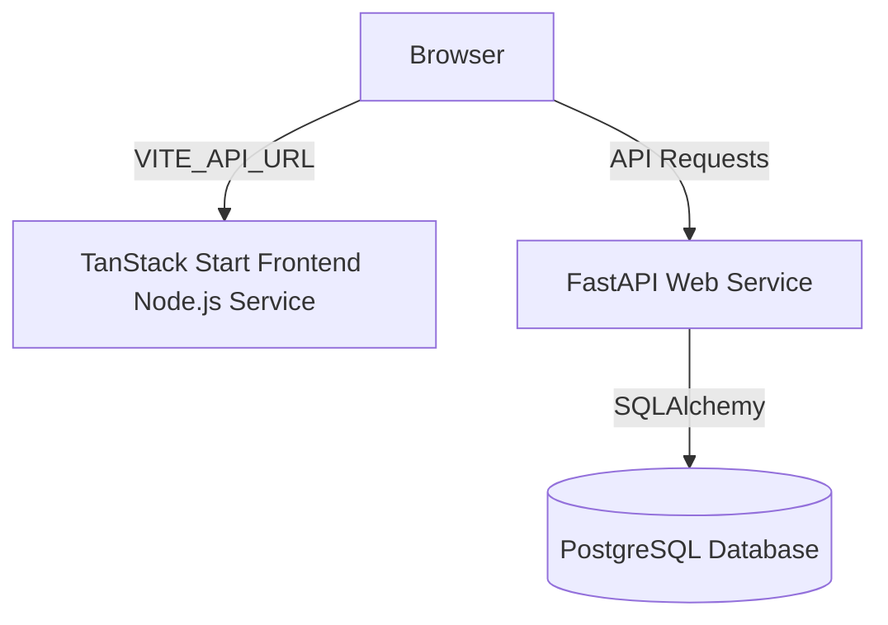

# Deploying Monsoon Copilot on Render

This guide provides step-by-step instructions for deploying both the **FastAPI Backend** and the **TanStack Start Frontend** on Render.

---

## Architecture Overview

- **Backend**: Python FastAPI service connected to PostgreSQL or SQLite.
- **Frontend**: TanStack Start SSR React App built with Vite/Nitro, running as a Node.js web service.

---

## Part 1: Deploying the Backend (FastAPI Web Service)

The backend runs as a standard Python Web Service.

### Step 1: Create a PostgreSQL Database on Render (Optional but Recommended)
1. Go to your [Render Dashboard](https://dashboard.render.com/) and click **New > PostgreSQL**.
2. Name your database (e.g., `monsoon-copilot-db`).
3. Click **Create Database**.
4. Once active, copy the **Internal Database URL** (which starts with `postgres://`).

### Step 2: Deploy the FastAPI Web Service
1. Click **New > Web Service**.
2. Select your GitHub repository.
3. Configure the following details:
   - **Name**: `monsoon-copilot-backend`
   - **Language**: `Python`
   - **Branch**: `main`
   - **Build Command**: `pip install -r backend/requirements.txt`
   - **Start Command**: `uvicorn backend.app.main:app --host 0.0.0.0 --port $PORT`
4. Expand the **Advanced** section to add Environment Variables:

| Key | Value | Notes |
| :--- | :--- | :--- |
| `DATABASE_URL` | *Your PostgreSQL Database URL* | Render automatically handles mapping `postgres://` to `postgresql://` thanks to our database patch. |
| `JWT_SECRET` | *A secure random string* | Used to sign auth tokens. |
| `GROQ_API_KEY` | *Your Groq API key* | Required for AI functions. |
| `GEMINI_API_KEY` | *Your Gemini API key* | Optional. |
| `OPENWEATHER_API_KEY` | *Your OpenWeather API key* | Required for live weather alerts. |
| `CLOUDINARY_URL` | *Your Cloudinary integration URL* | Optional (for citizen-submitted hazard photos). |

5. Click **Create Web Service**.

> [!NOTE]
> If you choose to use **SQLite** instead of PostgreSQL:
> 1. Set `DATABASE_URL` to `sqlite:////data/monsoon_copilot.db`
> 2. Add a persistent **Disk** to your Web Service in Render settings mounted at `/data` (size: 1 GB). This prevents your SQLite database from being wiped on every restart.

---

## Part 2: Deploying the Frontend (TanStack Start Node Web Service)

Since the frontend uses **TanStack Start** (which features Server-Side Rendering), it cannot be deployed as a static site. It must run as a **Node.js Web Service**.

### Step 1: Create the Web Service
1. Click **New > Web Service**.
2. Select your GitHub repository.
3. Configure the following details:
   - **Name**: `monsoon-copilot-frontend`
   - **Language**: `Node`
   - **Branch**: `main`
   - **Build Command**: `NITRO_PRESET=node-server npm run build`
   - **Start Command**: `node .output/server/index.mjs`
4. Expand the **Advanced** section to add Environment Variables:

| Key | Value | Notes |
| :--- | :--- | :--- |
| `VITE_API_URL` | `https://monsoon-copilot-backend.onrender.com` | **CRITICAL**: Set this to your actual backend Web Service URL. Vite will embed this at build-time. |

5. Click **Create Web Service**.

---

## Production Verification Checklist

1. **CORS Policy**: The backend is configured to accept requests from all origins by default. To restrict it, you can update `backend/app/main.py` CORSMiddleware to only allow your frontend Render URL.
2. **Environment Variables**: Double-check that all third-party API keys (Groq, OpenWeather, etc.) are set in Render.
3. **Database Migrations**: The backend automatically runs SQLite/PostgreSQL migrations on startup (`Base.metadata.create_all(bind=engine)`), so no manual database initialization is required.
